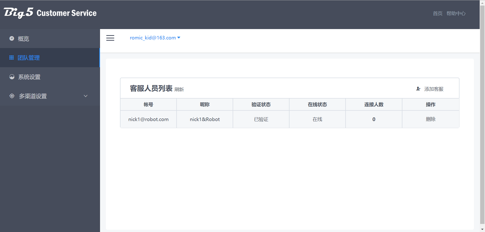
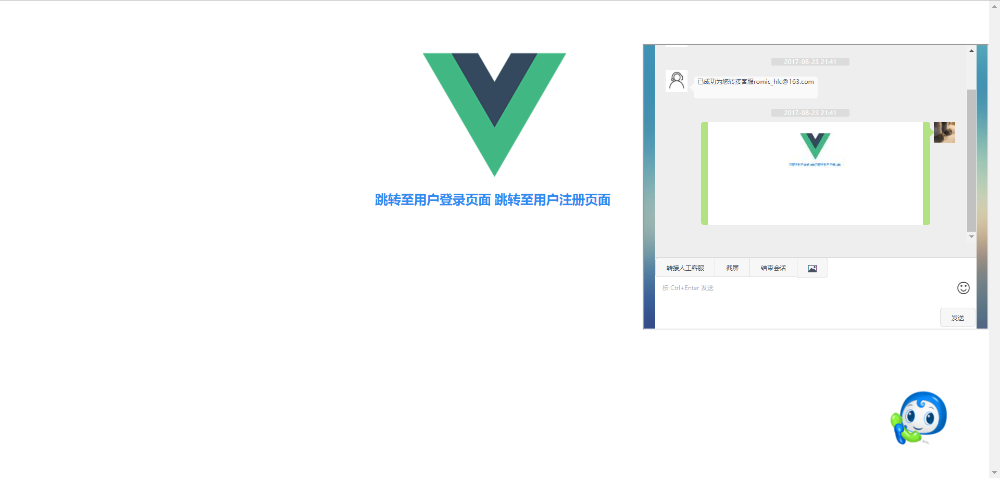

# 简介 / Introduction
kfsystem是一个类似于百度夜莺的在线客服系统。 
它包含完整的前台会话系统和后台管理系统，分别可以实现基本的客服-客户会话和客服信息的管理。 
kfsystem还实现了简单的自动回复机器人功能，并设计了面向多渠道的用户会话界面(PC网页/手机网页/网页嵌入式)。 

这个项目由Big5小组在2017年暑期完成。  

kfsystem主要使用以下组件构建： 
\- &nbsp; Django 1.11 
\- &nbsp; Django REST framework 3.6.4 
\- &nbsp; vue 2.3.3 
\- &nbsp; vue-resource 1.3.4 
\- &nbsp; socket.io 2.0.3 
\- &nbsp; iView 2.0.0 
\- &nbsp; html2canvas 0.5.0 
***
kfsystem is an online customer service system like Baidu Yeying. 
kfsystem contains a conversation system and a management system, which can realize the basic customer service - client conversation and customer service management.  
kfsystem also implements a simple automatic reply robot and three customer interfaces (PC webpage/mobile webpage/webpage embedded). 

The project was completed by the Big5 team in the summer of 2017.  

kfsystem is mainly built by the following components:  
\- &nbsp; Django 1.11 
\- &nbsp; Django REST framework 3.6.4 
\- &nbsp; vue 2.3.3 
\- &nbsp; vue-resource 1.3.4 
\- &nbsp; socket.io 2.0.3 
\- &nbsp; iView 2.0.0 
\- &nbsp; html2canvas 0.5.0   

# 示例 / Demo
管理系统 / Management System 

 客服会话界面 / Customer Service Conversation Interface 

 嵌入式会话界面 / Embedded Conversation Interface 

